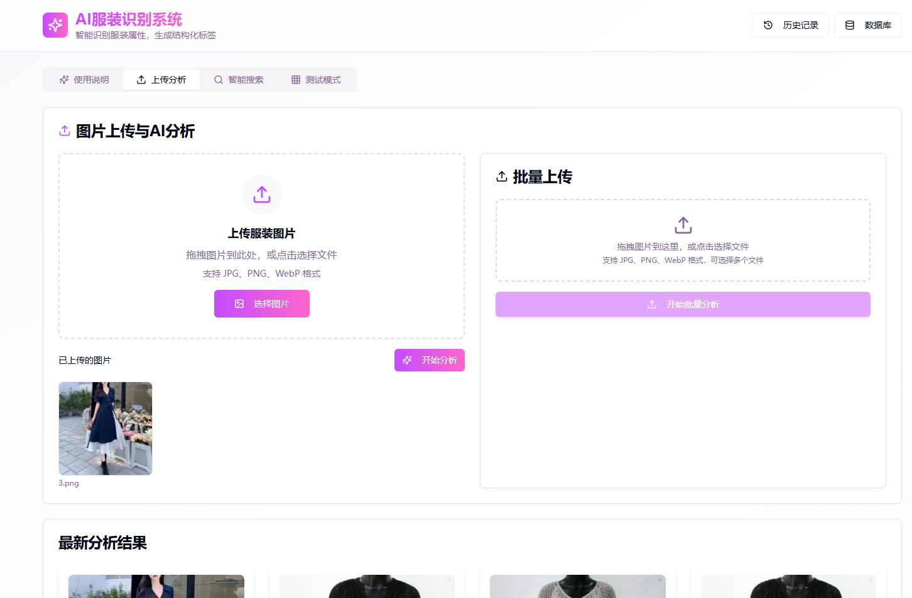
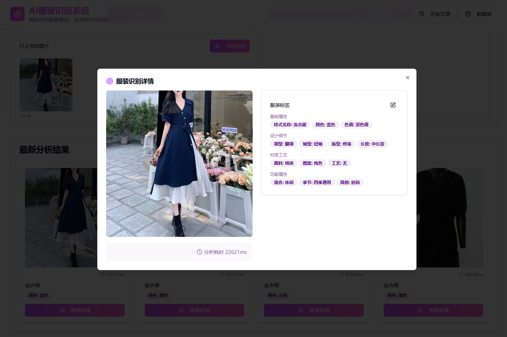
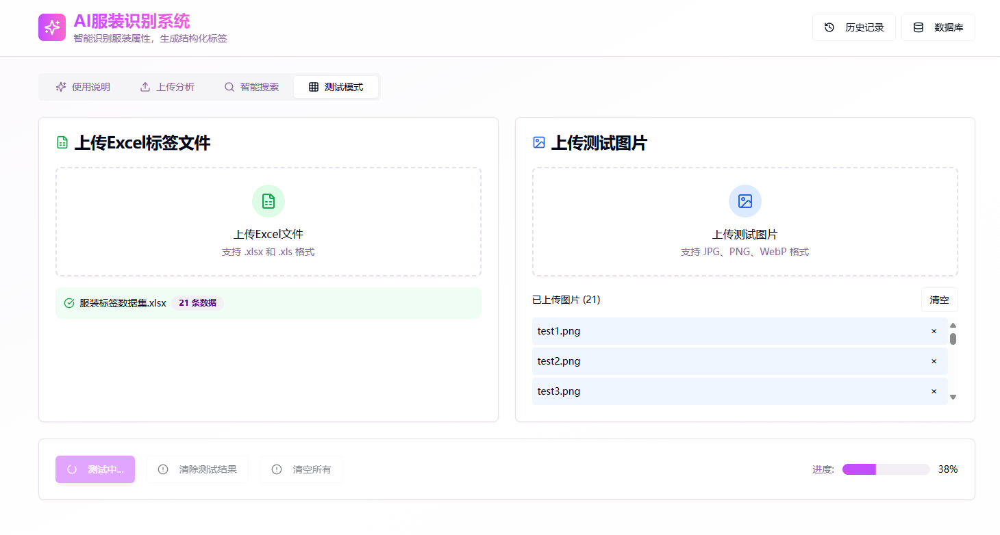
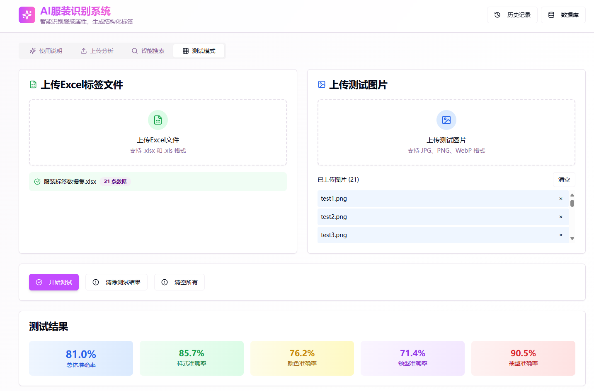
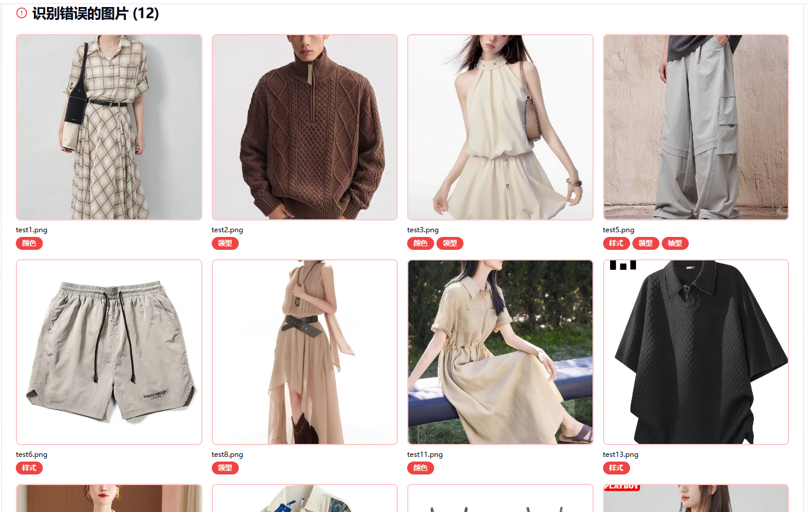
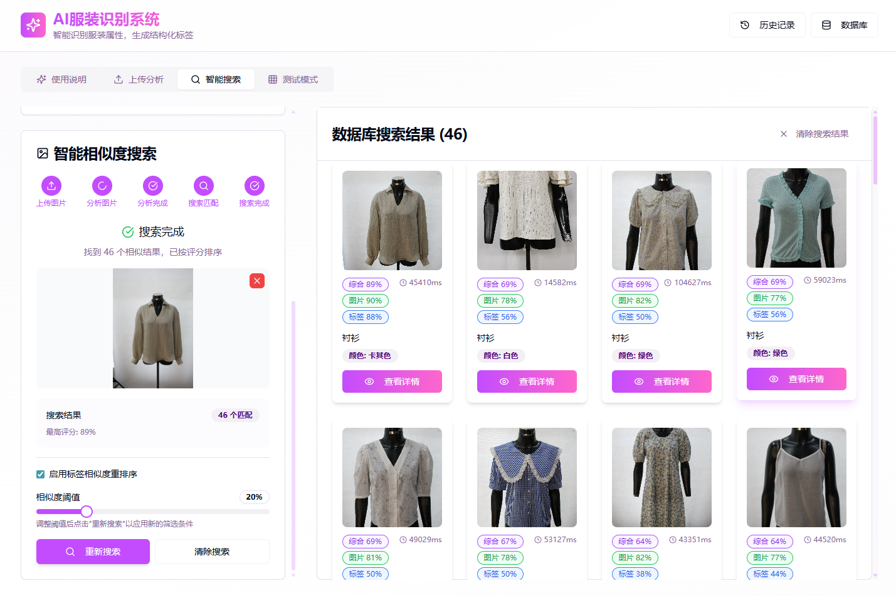
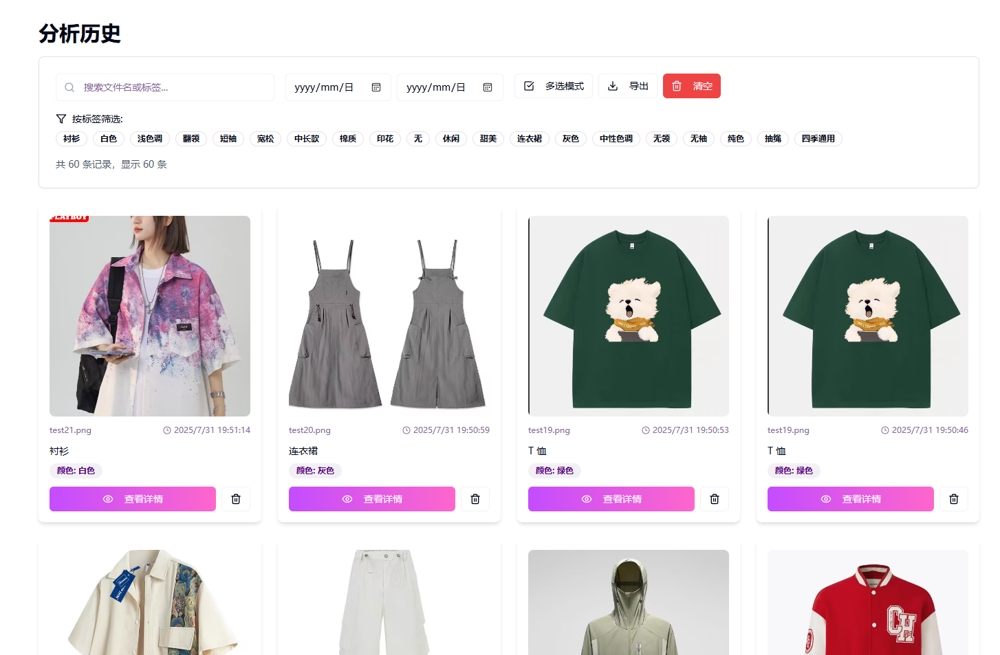
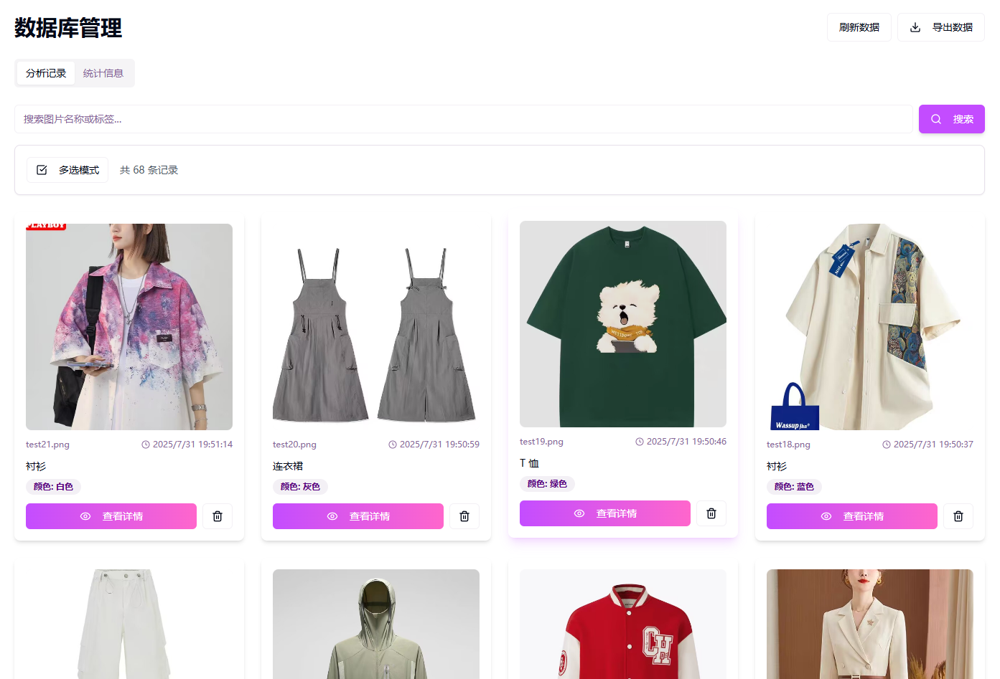

# Attire AI Explorer 使用说明

## 📖 项目简介

Attire AI Explorer 是一个基于人工智能的智能服装识别系统，集成了服装识别、图片相似搜索、数据管理等多项功能。系统采用现代化的Web界面，支持批量处理、实时统计、历史记录管理和PostgreSQL数据库集成，为用户提供完整的服装分析解决方案。

### 🎯 核心特色
- **AI驱动**：基于GPT-4 Vision的高精度服装识别技术
- **全栈解决方案**：前端React + 后端Node.js + PostgreSQL数据库
- **智能搜索**：基于图像特征的相似度搜索算法
- **企业级**：支持大规模数据处理和管理
- **用户友好**：直观的操作界面和详细的分析报告

## ✨ 主要功能

- 🔍 **智能服装识别**：基于GPT-4 Vision的高精度服装识别
- 📊 **批量处理**：支持Excel文件批量导入服装名称列表
- 🖼️ **多图片上传**：支持同时上传多张服装图片
- 📈 **实时统计**：实时显示识别准确率和进度
- 🔄 **智能重试**：自动处理API失败，确保识别完整性
- 💾 **状态持久化**：切换页面不丢失测试数据
- 📋 **详细分析**：提供错误分析和识别结果详情
- 🎨 **现代化UI**：响应式设计，支持多种设备
- 🔍 **图片相似搜索**：基于图像特征的智能相似度搜索
- 📚 **历史记录管理**：完整的分析历史记录和数据管理
- 🗄️ **数据库支持**：PostgreSQL数据库集成，支持数据持久化

## 📸 功能界面预览

### 上传分析功能

*支持Excel文件和图片批量上传，实时显示分析进度*


*详细的分析结果展示，包含准确率统计和错误分析*

### 测试模式

*智能测试模式，支持批量图片识别*


*实时进度跟踪和结果统计*


*详细的测试结果分析和数据导出*

### 图片相似搜索

*基于图像特征的智能相似度搜索，支持多种相似度算法*

### 历史记录管理

*完整的分析历史记录，支持搜索、筛选和数据管理*

### 数据库管理

*PostgreSQL数据库集成，提供数据统计和管理功能*

## 🚀 快速开始

### 环境要求

- Node.js 18+ 或 Bun
- 现代浏览器（Chrome、Firefox、Safari、Edge）
- OpenAI API 密钥

### 安装步骤

1. **克隆项目**
   ```bash
   git clone https://github.com/NanamiAkari/attire-ai-explorer.git
   cd attire-ai-explorer
   ```

2. **安装依赖**
   ```bash
   # 使用npm
   npm install
   
   # 或使用yarn
   yarn install
   
   # 或使用bun（推荐）
   bun install
   ```

3. **配置环境变量**
   ```bash
   # 复制环境变量模板
   cp .env.example .env
   ```
   
   编辑 `.env` 文件，填入配置信息：
   ```env
   # Coze API配置
   VITE_COZE_API_TOKEN=your_coze_api_token_here
   VITE_COZE_BOT_ID=your_bot_id_here
   
   # 后端API配置
   VITE_API_BASE_URL=http://localhost:3001/api
   
   # PostgreSQL数据库配置
   VITE_DB_HOST=localhost
   VITE_DB_PORT=5432
   VITE_DB_NAME=clothing_analysis
   VITE_DB_USER=postgres
   VITE_DB_PASSWORD=your_password_here
   ```

4. **设置数据库**
   
   确保PostgreSQL服务正在运行，并创建数据库：
   ```sql
   CREATE DATABASE clothing_analysis;
   ```

5. **启动后端服务器**
   ```bash
   # 进入服务器目录
   cd server
   
   # 安装依赖
   npm install
   
   # 启动后端服务器
   npm start
   ```
   
   后端服务器将在 `http://localhost:3001` 启动。

6. **启动前端项目**
   ```bash
   # 返回项目根目录
   cd ..
   
   # 开发模式
   npm run dev
   
   # 生产构建
   npm run build
   npm run preview
   ```

## 📝 使用指南

### 1. 主要功能介绍

#### 🔍 上传分析功能
系统的核心功能，支持智能服装识别和批量分析：

**功能特点：**
- 智能AI识别：基于先进的视觉识别技术
- 批量处理：同时处理多张图片，提高效率
- 实时反馈：显示识别进度和准确率统计
- 详细分析：提供每张图片的详细识别结果


*上传分析主界面*

**使用步骤：**
1. **上传数据**：上传待识别图片
2. **开始分析**：点击开始按钮进行智能识别
3. **查看结果**：实时查看识别结果和准确率


*详细的分析结果和准确率统计*

#### 🎯 图片相似搜索
基于图像特征的智能搜索功能，快速找到相似服装：

**功能特点：**
- 视觉相似度匹配：基于图像特征进行智能匹配
- 快速检索：毫秒级响应速度
- 多样化结果：提供多个相似度选项
- 直观展示：可视化相似度评分


*图片相似搜索界面 - 上传图片即可找到相似服装*

**使用方法：**
1. 上传目标图片
2. 系统自动分析图像特征
3. 返回相似度排序的结果
4. 点击查看详细信息

### 2. 测试模式详解

#### 数据准备

**Excel文件格式：**
创建一个Excel文件，包含详细的服装属性标注：

| filename | style | color | 色调 | collar | sleeve | 版型 | 长度 | 面料 | 图案 | 工艺 | 场合 | 季节 | 风格 |
|----------|-------|-------|------|--------|--------|------|------|------|------|------|------|------|------|
| test1.png | 连衣裙 | 白色 | 浅色调 | 圆领 | 短袖 | A字型 | 中长款 | 棉质 | 纯色 | 拼接 | 休闲 | 夏季 | 简约 |
| test2.png | 毛衣 | 棕色 | 深色调 | 高领 | 长袖 | 直筒 | 中长款 | 毛料 | 纯色 | 拉链 | 休闲 | 秋季 | 简约 |
| test3.png | 连衣裙 | 蓝色 | 浅色调 | 无 | 无 | 直筒 | 长款 | 化纤 | 纯色 | 褶皱 | 运动 | 夏季 | 简约 |

**注意事项：**
- 第一行应为字段标题（filename, style, color等）
- 支持 `.xlsx` 和 `.xls` 格式
- 建议使用标准化的属性值以提高识别准确率
- 支持中英文字段名（如 filename 或 文件名）

**图片要求：**
- **格式**：支持 JPG、PNG、WEBP
- **大小**：建议每张图片小于10MB
- **质量**：清晰的服装图片，避免模糊或遮挡
- **数量**：支持批量上传多张图片

#### 测试流程


*测试模式主界面*

**步骤一：上传Excel文件**
1. 点击"选择Excel文件"按钮
2. 选择包含服装属性标注的Excel文件
3. 系统会自动解析并显示服装属性数据

**步骤二：上传对应测试图片**
1. 点击"选择图片"按钮或拖拽图片到上传区域
2. 支持同时选择多张图片
3. 系统会显示已上传的图片预览

**步骤三：开始测试分析**
1. 确认Excel数据和图片都已上传
2. 点击"开始测试"按钮
3. 系统开始自动识别每张图片


*实时测试进度和统计信息*


*测试完成后的详细统计报告*

### 3. 功能详解

#### 智能重试机制
- 自动检测API调用失败
- 智能重试失败的请求
- 确保所有图片都能得到识别结果

#### 状态持久化
- 自动保存测试进度到本地存储
- 切换页面或刷新浏览器不会丢失数据
- 支持恢复之前的测试状态

#### 结果分析
- **准确率统计**：实时计算识别准确率
- **错误分析**：列出识别错误的图片
- **详细结果**：显示每张图片的识别结果和置信度


*完整的测试结果分析界面*

#### 图片相似搜索
- **智能相似度算法**：基于图像特征的多维度相似度计算
- **实时搜索**：上传图片即可快速找到相似服装
- **相似度阈值调节**：支持自定义相似度筛选条件
- **批量比较**：支持与数据库中所有图片进行相似度比较


*图片相似搜索界面，支持多种相似度算法*

#### 历史记录管理
- **完整记录**：保存所有分析历史和结果数据
- **智能搜索**：支持按时间、准确率、服装类型等条件筛选
- **数据导出**：支持将历史记录导出为Excel或JSON格式
- **批量操作**：支持批量删除、编辑历史记录


*历史记录管理界面，提供完整的数据管理功能*

#### 数据库管理
- **PostgreSQL集成**：企业级数据库支持，确保数据安全
- **实时统计**：提供详细的数据统计和分析报告
- **数据备份**：支持数据库备份和恢复功能
- **性能监控**：实时监控数据库连接状态和性能指标


*数据库管理界面，提供完整的数据统计和管理功能*

#### 数据管理
- **清除测试结果**：只清除识别结果，保留上传的文件
- **清空所有**：清除所有数据和上传的文件
- **重新测试**：基于现有数据重新开始识别
- **数据同步**：支持本地存储与数据库之间的数据同步

## ⚙️ 高级配置

### API配置

在 `src/lib/openai.ts` 中可以调整以下参数：

```typescript
// 模型配置
model: "gpt-4-vision-preview"

// 最大token数
max_tokens: 300

// 并发请求数
const CONCURRENT_REQUESTS = 3

// 重试次数
const MAX_RETRIES = 3
```

### 识别提示词

可以在 `src/lib/openai.ts` 中自定义识别提示词：

```typescript
const prompt = `请仔细观察这张服装图片，从以下列表中选择最匹配的服装名称：
${clothingList}

要求：
1. 只返回最匹配的一个服装名称
2. 必须从提供的列表中选择
3. 如果不确定，选择最相似的
4. 不要添加任何解释或其他文字`;
```

## 📊 数据格式说明

### Excel数据格式

系统支持详细的服装属性标注，Excel文件应包含以下字段：

| 列名 | 数据类型 | 说明 | 示例 |
|------|----------|------|------|
| filename | 文本 | 图片文件名 | test1.png |
| style | 文本 | 服装样式/类型 | 连衣裙、衬衣、裤子等 |
| color | 文本 | 主要颜色 | 白色、黑色、灰色等 |
| 色调 | 文本 | 颜色深浅 | 浅色调、深色调、中性色调等 |
| collar | 文本 | 领型设计 | 圆领、高领、立领等 |
| sleeve | 文本 | 袖型长度 | 长袖、短袖、无袖等 |
| 版型 | 文本 | 服装版型 | A字型、直筒、宽松等 |
| 长度 | 文本 | 服装长度 | 长款、中长款、短款等 |
| 面料 | 文本 | 材质类型 | 棉质、化纤、混纺等 |
| 图案 | 文本 | 图案设计 | 纯色、印花、条纹等 |
| 工艺 | 文本 | 制作工艺 | 组扣、拼接、刺绣等 |
| 场合 | 文本 | 适用场合 | 休闲、职场、运动等 |
| 季节 | 文本 | 适用季节 | 春季、夏季、秋季、冬季 |
| 风格 | 文本 | 服装风格 | 简约、优雅、休闲等 |

**注意事项：**
- 支持中英文字段名（如 filename 或 文件名）
- 建议使用标准化的属性值以提高识别准确率
- Excel文件格式支持 `.xlsx` 和 `.xls`
- 第一行应为字段标题

### 识别结果格式

系统会输出结构化的识别结果：

```json
{
  "imageName": "图片文件名",
  "tags": {
    "样式名称": "连衣裙",
    "颜色": "白色",
    "色调": "浅色调",
    "领型": "圆领",
    "袖型": "短袖",
    "版型": "A字型",
    "长度": "中长款",
    "面料": "棉质",
    "图案": "纯色",
    "工艺": "拼接",
    "场合": "休闲",
    "季节": "夏季",
    "风格": "简约"
  },
  "confidence": 85,
  "analysisTime": 1200
}
```

## 🔧 故障排除

### 常见问题

#### 1. API调用失败
**症状**：显示"API调用失败"错误

**解决方案**：
- 检查API密钥是否正确配置
- 确认OpenAI账户余额充足
- 检查网络连接是否正常
- 验证API密钥权限

#### 2. 图片上传失败
**症状**：图片无法上传或显示错误

**解决方案**：
- 检查图片格式是否支持（JPG、PNG、WEBP）
- 确认图片大小不超过限制
- 尝试压缩图片后重新上传

#### 3. Excel解析错误
**症状**：Excel文件无法解析或数据显示异常

**解决方案**：
- 确认Excel文件格式正确（.xlsx或.xls）
- 检查第一列是否包含服装名称
- 尝试重新保存Excel文件

#### 4. 识别结果不准确
**症状**：识别准确率较低

**解决方案**：
- 使用更清晰的服装图片
- 确保图片中服装清晰可见
- 调整Excel中的服装名称描述
- 使用英文服装名称

### 性能优化

#### 1. 提高识别速度
- 调整并发请求数量（在API限制范围内）
- 压缩图片大小
- 使用更快的网络连接

#### 2. 提高识别准确率
- 使用高质量的服装图片
- 确保服装名称描述准确
- 避免图片中有多件服装
- 使用标准的服装分类名称

## 🔒 安全注意事项

1. **API密钥安全**
   - 不要将API密钥提交到代码仓库
   - 使用环境变量管理敏感信息
   - 定期更换API密钥

2. **数据隐私**
   - 上传的图片仅用于识别，不会被存储
   - 识别结果保存在本地浏览器中
   - 清除浏览器数据会删除所有本地结果

3. **网络安全**
   - 建议在HTTPS环境下使用
   - 避免在公共网络下处理敏感数据

## 📞 技术支持

如果您在使用过程中遇到问题，可以：

1. 查看本文档的故障排除部分
2. 检查浏览器控制台的错误信息
3. 在GitHub仓库中提交Issue
4. 联系技术支持团队

## 📄 许可证

本项目采用 MIT 许可证，详情请查看 LICENSE 文件。

---

## 📈 更新日志

### v2.0.0 (2024年12月)
- ✨ 新增图片相似搜索功能
- ✨ 新增历史记录管理系统
- ✨ 集成PostgreSQL数据库支持
- ✨ 新增数据库管理界面
- 🔧 优化相似度算法，提升搜索精度
- 🔧 改进用户界面，增强用户体验
- 🔧 完善错误处理和重试机制

### v1.0.0 (2024年11月)
- 🎉 初始版本发布
- ✨ 基础服装识别功能
- ✨ Excel批量处理
- ✨ 实时统计和分析

---

**当前版本**：v2.0.0  
**最后更新**：2025年7月  
**维护团队**：NanamiAkari  
**项目地址**：[GitHub Repository](https://github.com/NanamiAkari/attire-ai-explorer)